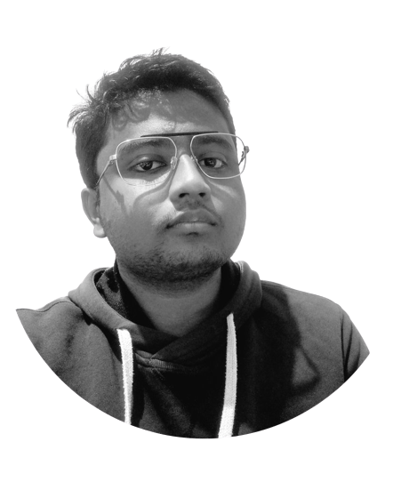

Hi!..I'm Nitish Pattanaik, a lifelong programming enthusiast and a person who wants to do something useful in this world with the knowledge of computer science. I love computers, electronics and all kinds of computation in general.

## What drives me?

To me being useful is most important thing. Believe it or not. You can learn anything, but being useful with your knowledge is quite hard. And it's the thing that everyone should care about.

For some person it's winning. For others it may be appreciation, respect, patriotism, love or something else. For me it's definitely, **BEING USEFUL**. There is another thing what drives me i.e. _PURE HAPPINESS_. Ask yourself why we humans do anything to get money, to get sexual pleasure or to get love. Just analyze these things, at the end everyone targeting happiness. Therefore, these two things drives me to do something more and more and more.

## My Interests

You can guess this, because I love computers. So, my interests and projects needs to be based on computer science. I want to learn the whole stack of computers. By referrencing whole computer stack means from the very beginning like physics of computers to building application softwares. The whole computer stack is:

*   Application software
*   Operating Systems
*   Architecture
*   Micro-architecture
*   Logic
*   Digital Circuits
*   Analog Circuits
*   Devices
*   Physics

I want to make projects in every part of the above stack. I want to learn computer science and computation my whole life. I do believe that computers are going to change our life.

But remember, I started my journey as a programmer very recently. I'm a college student now. I said, I want to do those things, but I didn't do that still now. I'm learning and exploring the computer science now. Eventually, this is what I want to do throughout my life.

## What to know more about me?

### Books

You can know more about a person by reading their favorite books. My favorites are, Elon Musk biography book, Walter Isaaction books, SriMad Bhagavat Gita(Indian religional book), Wings of fire by APJ Abdul kalam and many more. I tried self-help books, but they are boring. I don't like them.

### Entertainment

I do love web sereis, movies and music. I do watch different language movies and web-series, with english subtitles. I just want to know more about different country cultures. As an Indian, I came across a different genre of movies, because there are too many languages in India. I love my culture and tradition.

### Projects

Just visit my GITHUB page.

## Contact Me

You can find me one Twitter as [@NitishPattanaik](https://twitter.com/NitishPattanaik) and also on Threads as [@nitish\_pattanaik.](https://www.threads.net/@nitish_pattanaik)

Wants to MAIL me!!! := [nitishkpattanaik@gmail.com](malito:nitishkpattanaik@gmail.com)

## List of my links

*   [GitHub(main)](https://github.com/nitish-pattanaik/)
*   [GitHub(for wsl)](https://github.com/nkpattanaik/)
*   [Twitter](https://twitter.com/NitishPattanaik)
*   [Instagram](https://www.instagram.com/nitish_pattanaik/)
*   [Threads](https://www.threads.net/@nitish_pattanaik)
*   [Twitch](https://www.twitch.tv/nitishpattanaik)
*   [YouTube](https://www.youtube.com/@NitishPattanaik)
*   [Website: BLOG(customized)](https://nkpattanaik.github.io/)
*   [Website: Jekyll Minima](https://nitish-pattanaik.github.io/)

## Footer
*   {"name"=>"Nitish Pattanaik", "email"=>"nitishkpattanaik@gmail.com"}

Place to show my INTERNET identity. It includes all of my researched thought process and works. You can call it a BLOG, my journey,etc...
