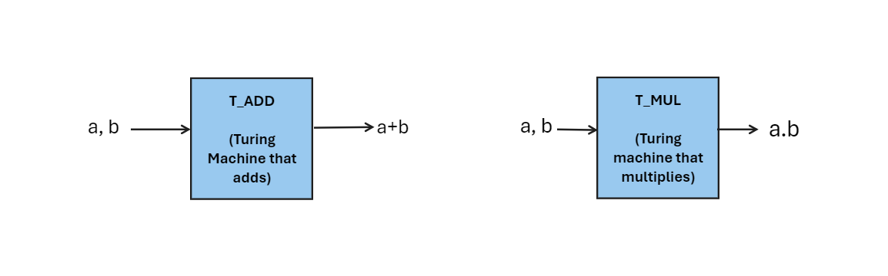
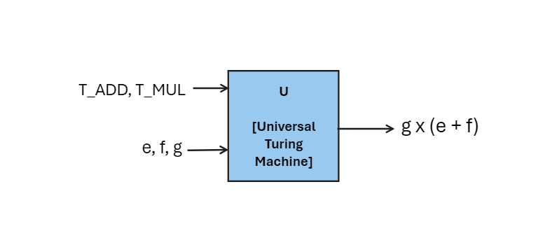

A Journey Through the Layers of Computing.
<!-- more -->

# A Hierarchical Descent Into Computing
Computing is any goal-oriented activity requiring, benefiting from, or creating computing machinery. It includes study and experimentation of algorithmic processes, and development of both hardware and software.
Simply, computing refers to solving problems using any computer. But, how a computer is able to solve any problem.

## A Bit of History
Alan Turing is the reason for creation and existence of today’s modern world computers. In order to provide a definition to computation, he proposed the idea of the TURING MACHINE in 1973. He states that all computations could be carried out by that turing machine. Back in the days, computation mainly refers to some very minimal tasks like adding and multiplying. One turing machine can be designed to perform additions, while another can be designed to perform multiplying. Like this, you can build multiple turing machines for multiple computations. 

<!--  -->

This black box model provides no information as to exactly how  the operation is performed, and indeed, there are many ways to add or multiply two numbers. He proposed that every computation can be performed by some Turing machine. We call this Turing’s Thesis.

Universal Turing Machines are special, they can perform any computation not just a particular type of computation. You have to give descriptions of computation that you want to perform and data on which you have to perform that computation. 
Suppose you wanted to compute g . (e + f) . You would simply provide to U descriptions of Turing machines to add and to multiply, and three inputs i.e. g, e & f. After that, U would do the rest.

<!--  -->

Computers and Universal Turing Machines are essentially the same thing in principle. These two machines can compute anything that can be computed, because they are programmable. 

## What's The Idea?
From 1973 to 2024, numerous inventions were made to make computers to do all kinds of computations. We have problems and we want to solve those problems using computing. We need to build a machine (i.e computer) which takes two types of input. These are descriptions of computation and data. After that it performs your desired computation on those data and gives us output. One architecture is proposed to do this, called Von Neumann architecture. 

**How can we get the electrons to do that work?**
- Here the concept of ABSTRACTION comes to existence. Various levels of transformations are needed to do our work using electrons. 
- Computing, at its core, is a fascinating dance between the abstract and the physical.  
- It's a layered system, often visualized as a "stack," where each layer builds upon the one below. Let's delve into this intricate world:

## Layers of Stack

### Layer01: Application Software
- First, we have problems. But we need algorithms which can be used to solve those problems using computations of various kinds. Then we must build a program that instructs the computer which computations  would be applied in which order based on the algorithm. Here, we have to provide the data along with the program. 
- Programs are nothing but just the list of instructions that the computer should perform to solve a particular task.
- Suppose, you write a simple C program to print “hello world” to the console. Here, hello_world.c file is your applications software.

### Layer02: Operating Systems
Operating systems provide an environment where application software can be executed. OS provides hardware support and execution environment to the application softwares.
*LifeCycle of a C program(By OS)*
1. Source Code Creation (c program)
2. Preprocessing (preprocessor)
 - Preprocessor includes all code which are included using #include statements.
3. Compilation: (C compiler)
4. Translation to machine code
5. Assembly code generation
6. Optimization
7. Object file creation
8. Linking (Linker, like gnu ld)
- Linking brings together all object files produced by the compiler with any necessary libraries.
- It resolves references to functions & symbols between object files & libraries.
- Linked finally produces the executable file based on the OS.
9. Loading (OS Loader specific to each OS)
- Loads the executable file from storage
- Allocates memory for the program’s code, data segments and initial stack
- Loads the code & data segments into memory
10. Execution (By the processor)
- The processor starts to fetch and execute the machine code instructions from memory.
- Execution begins from main memory.
11. Termination
- Normal termination
- Exit with error
- Crash
12. CleanUp (By OS)
- Deallocates memory
- Closes any files or resources.

Here, you can clearly see that the OS acts as a control program & resource  allocator.

### Layer03: Architecture (ISA)
- Here architecture simply refers to the ISA(Instruction Set Architecture) of any particular processor. In general, an ISA defines the supported instructions, data types, registers, the hardware support for managing main memory, fundamental features (such as the memory consistency, addressing modes, virtual memory), and the input/output model of a family of implementations of the ISA. 

- Above I mentioned that the compiler compiles a  .c file to an executable file that can be run by the ISA.
*Input file > preprocessing > parsing > code gen & optimization > Assembler > linker > executable file*

- That assembly file after the “code generation & optimization” stage contains registers and operations particular to a specific ISA. 
Examples: x86, x86_64, MIPS, ARM, RISC-v

### Layer04: Micro-architecture
- Microarchitecture simply refers to “how a processor implements a particular ISA”. A given ISA can be implemented using different microarchitectures. Intel pentium and AMD Athlon implement the same x86 ISA, but their microarchitecture is significantly different from each other.

- The ISA includes the instructions, execution model, processor registers, address and data formats among other things. The microarchitecture includes the constituent parts of the processor and how these interconnect and interoperate to implement the ISA.
- Different microarchitecture of x86 ISA produced by INTEL over the years: 
Ex. Pentium pro(1995), Core(2006),  skylake(2015), coffeelake(2017), alderlake(2021), etc.

### Layer05: Logic Gates
- **Gate Types:** The most fundamental logic gates are AND, OR, NOT, and XOR. Each gate performs a specific operation on binary inputs (0 or 1) to produce a binary output.
- **AND:** Outputs 1 only if both inputs are 1. (Think of it as needing two keys to unlock a door)
- **OR:** Outputs 1 if at least one input is 1. (Think of it as opening a door with either key)
- **NOT:** Inverts the input. Outputs 1 if the input is 0, and vice versa. (Think of it as a light switch)
- **XOR:** Outputs 1 only if the inputs are different (0,1 or 1,0). (Think of it as a light switch that only turns on when the previous state is off)

- **Implementation:** Logic gates are physically implemented using transistors, which are tiny switches that control the flow of current. Different combinations of transistors create the functionalities of various gates.

- **Combinational vs. Sequential Logic:**
Logic circuits can be categorized into two types:
    - Combinational: Output depends solely on the current inputs. (Think of a simple calculator performing addition)
    - Sequential: Incorporate memory elements (flip-flops) to "remember" past inputs and influence future outputs. (Think of a counter that keeps track of clock cycles)

### Layer06: Digital Circuits
- **Building Blocks:** Digital circuits are constructed from logic gates, along with other electronic components like:
- **Multiplexers (Muxes):** Select one of several input signals based on a control signal. (Think of a traffic light controller)
- **Decoders:** Convert a binary code to a single active output line. (Think of translating an address into a specific memory location)
- **Encoders:** Convert a set of data lines into a binary code. (Think of converting keystrokes into digital signals)
- **Signal Levels:** Digital circuits operate with distinct voltage levels representing logic 0 (low voltage) and logic 1 (high voltage). This clear distinction allows for reliable data transmission and processing.
- **Fabrication:** Digital circuits are manufactured on silicon wafers using a process called photolithography, which allows for creating microscopic features and interconnections between components.

### Layer07: Analog Circuits
- **Signal Representation:** Unlike digital circuits, analog circuits deal with continuous signals that can vary over a range. These signals can represent real-world phenomena like voltage variations in audio or light intensity.
- **Components:** Key components in analog circuits include:
Operational Amplifiers (Op-Amps): High-gain amplifiers used for various functions like signal amplification, filtering, and comparison.
- **Capacitors:** Store electrical charge and can be used for filtering or temporary signal storage.
- **Inductors:** Oppose changes in current and can be used for filtering or energy storage.
- **Applications:** Analog circuits play a vital role in:
Signal Conditioning: Amplifying weak signals or filtering out unwanted noise before feeding them to digital circuits.
- **A/D Conversion:** Converting analog signals into digital representations for processing within computers.
- **D/A Conversion:** Converting digital signals back into analog signals for output to speakers, displays, or other devices.
### Layer08: Devices
- **Transistors:** The fundamental building block of modern electronics. Transistors act as electronic switches, allowing for the control of current flow. Different transistor types (e.g., MOSFET, BJT) offer specific functionalities.
- **Integrated Circuits (ICs):** Also known as microchips, ICs contain millions or even billions of transistors and other electronic components interconnected on a single silicon chip. These chips form the core of processors, memory, and other hardware components.
- **Fabrication Process:** ICs are manufactured using complex and precise fabrication processes involving photolithography, etching, and deposition of thin films.

### Layer09: Physics 
- **Semiconductor Physics:** Understanding the behavior of semiconductors, materials that can conduct electricity under certain conditions, is crucial for designing transistors and other electronic devices.
- **Boolean Algebra:** This branch of mathematics provides the foundation for representing logic operations using 0s and 1s. It forms the basis for designing and analyzing digital circuits.
- **Electromagnetism:** Electromagnetic principles govern how electrical signals propagate through circuits, influencing factors like signal integrity and transmission speed.

## Conclusion
- In summary, from the natural language description of a problem to the electrons that actually solve the problem by moving from one voltage potential to another, many transformations need to be performed. 
- If we could speak electron, or if the electrons could understand English, perhaps we could just walk up to the computer and get the electrons to do our bidding. 
- Since we can’t speak electron and they can’t speak English, the best we can do is this systematic sequence of transformations. At each level of transformation, there are choices as to how to proceed. 
- Our handling of those choices determines the resulting cost and performance of our computer.